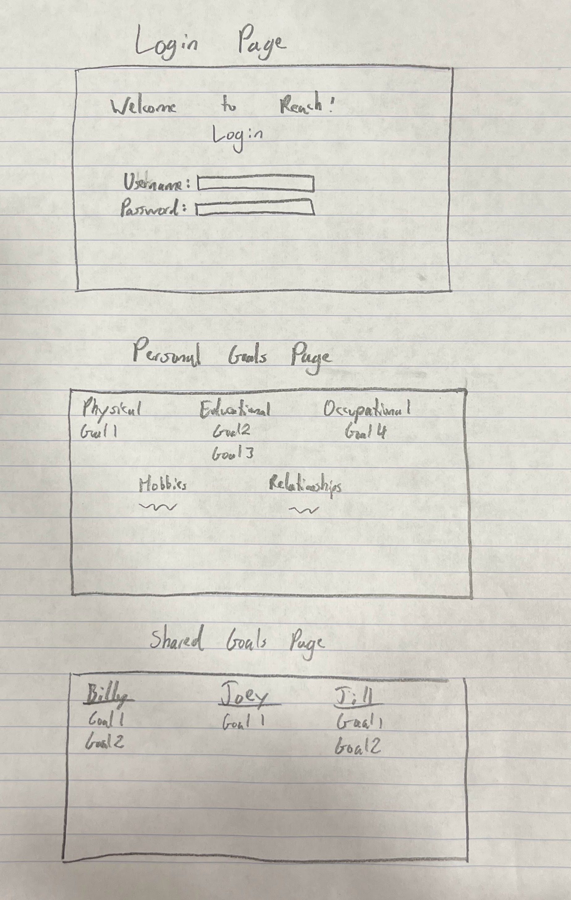

# REACH!
# Specification Deliverable
### Elevator Pitch

We all have goals. Some are small. Some are big. But regardless  of what they are, writing down goals and having somebody keep us accountable to them makes it much more likely to achieve them. "REACH!" lets you do all this in one app. On "REACH!", you can add your own goals, set a time period, and optionally add another user on the app as an accountability buddy. They'll be notified as you log (or fail to log) progress, so they can help you become your best self.

### Design

### Key Features
- Secure login over HTTPS
- Ability to select categories of goals, including phyiscal, educational, occupational, hobbies, and relationship
- Ability to write and set goals in each category
- Ability for a user to share their goal with another user
- Goals ae persistently stored
- Ability to report progress on a goal
### Technologies
- HTML - uses correct HTML structures for application. Three HTML pages. One for login, one for personal goals, and one for goals shared by other users
- CSS - style application so that it looks good. Different colors for different goal categories
- JavaScript - provides login, displaying personal goals, and displaying other users' goals
- Service - Backend servie with endpoints for:
    - login
    - retrieving goals
    - sharing goals with other users
- DB/Login - stores users and goals in database. Credentials securely stored in database. Can't access or create foals without authentication
- WebSocket - When user share their goals, their goal is broadcast to the other chosen user
- React - application uses the React web framework
<!-- ## HTML Deliverable
## CSS Deliverable
## JavaScript Deliverable
## Service Deliverable
## DB/Login Deliverable
## WebSocket Deliverable
## React Deliverable -->